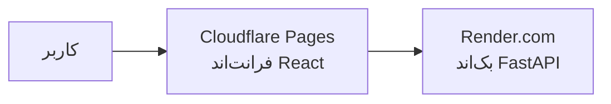

# راهنمای کامل پابلیش و دپلویمنت FX Brain

این راهنما مراحل گام‌به‌گام پابلیش پروژه **FX Brain** را به صورت **۱۰۰٪ رایگان** آموزش می‌دهد.

---

## معماری پروژه
- **فرانت‌اند**: React + Vite + Tailwind CSS (قابل میزبانی رایگان روی Cloudflare Pages یا Vercel)
- **بک‌اند**: Python FastAPI + Uvicorn (قابل میزبانی رایگان روی Render.com یا Koyeb یا سرور اختصاصی)

---

## روش پیشنهادی: دپلویمنت رایگان با Cloudflare Pages + Render.com



### گام اول: دپلویمنت بک‌اند روی Render.com (رایگان)

1. مطمئن شوید آخرین تغییرات پروژه در گیت‌هاب پوش شده است:
   ```bash
   git add .
   git commit -m "feat: prepare production deployment"
   git push origin main
   ```
2. وارد وب‌سایت [Render.com](https://render.com) شوید و با حساب گیت‌هاب خود لاگین کنید.
3. روی دکمه **New +** کلیک کرده و گزینه **Blueprint** را انتخاب کنید (فایل `render.yaml` موجود در پروژه تمام تنظیمات را خودکار انجام می‌دهد).
   * یا می‌توانید گزینه **Web Service** را انتخاب کرده و مقادیر زیر را دستی وارد کنید:
     * **Repository**: `abbasi0abolfazl/FXBrain`
     * **Root Directory**: `api`
     * **Environment / Runtime**: `Python 3`
     * **Build Command**: `pip install -r requirements.txt`
     * **Start Command**: `uvicorn main:app --host 0.0.0.0 --port $PORT`
     * **Instance Type**: `Free`
4. روی **Create Web Service** کلیک کنید.
5. پس از ۲ الی ۳ دقیقه، سرویس شما فعال شده و یک آدرس امن HTTPS به شما اختصاص داده می‌شود:
   `https://fxbrain-backend.onrender.com` (این آدرس را کپی کنید).

---

### گام دوم: دپلویمنت فرانت‌اند روی Cloudflare Pages (رایگان)

1. وارد کنترل پنل [Cloudflare Dashboard](https://dash.cloudflare.com) شوید.
2. از منوی سمت چپ به بخش **Compute (Workers) > Workers & Pages** بروید.
3. روی **Create application** کلیک کرده و تب **Pages** را انتخاب کنید.
4. روی **Connect to Git** کلیک کرده و ریپازیتوری `abbasi0abolfazl/FXBrain` را متصل کنید.
5. تنظیمات زیر را وارد کنید:
   * **Project name**: `fxbrain` (یا هر نام دلخواه دیگر)
   * **Production branch**: `main`
   * **Framework preset**: `Vite`
   * **Build command**: `npm run build`
   * **Build output directory**: `dist`
6. باز کردن بخش **Environment variables** (بسیار مهم):
   * متغیر با نام: `VITE_API_URL`
   * مقدار: آدرس بک‌اند دریافتی از Render در گام اول (مثال: `https://fxbrain-backend.onrender.com`)
7. روی دکمه **Save and Deploy** کلیک کنید.
8. ظرف مدت کمتر از ۱ دقیقه سایت شما روی آدرس اختصاصی کلودفلر (مثلاً `https://fxbrain.pages.dev`) لایو خواهد شد.

---

## روش جایگزین: اجرای کامل با Docker Compose (روی سرور شخصی یا VPS)

اگر مایلید پروژه را روی سرور لینوکسی اختصاصی خود اجرا کنید:
1. داکر و کامپوز را روی سرور نصب کنید:
   ```bash
   sudo apt update && sudo apt install -y docker.io docker-compose
   ```
2. پروژه را کلون کنید:
   ```bash
   git clone git@github.com:abbasi0abolfazl/FXBrain.git
   cd FXBrain
   ```
3. با یک دستور کل استک (بک‌اند پایتون و فرانت‌اند با وب‌سرور Nginx) را اجرا کنید:
   ```bash
   docker compose up -d --build
   ```
* فرانت‌اند روی پورت `80` و بک‌اند روی پورت `8000` در دسترس خواهد بود.

---

## نکات مهم در محیط Production
1. **Sleep شدن سرویس رایگان Render**: سرورهای رایگان Render در صورتی که ۱۵ دقیقه درخواستی دریافت نکنند به خواب می‌روند و درخواست اول ممکن است ۳۰ ثانیه طول بکشد تا لود شود. برای جلوگیری از آن می‌توانید از سرویس‌های مانیتورینگ رایگان مثل [UptimeRobot](https://uptimerobot.com) استفاده کنید تا هر ۱۰ دقیقه یک‌بار آدرس `https://your-backend.onrender.com/health` را صدا بزند.
2. **اتصال دامنه اختصاصی**: هم در Cloudflare Pages و هم در Render می‌توانید در تب **Custom Domains**، دامنه دات‌کام یا دات‌آی‌آر اختصاصی خود را متصل کنید.
